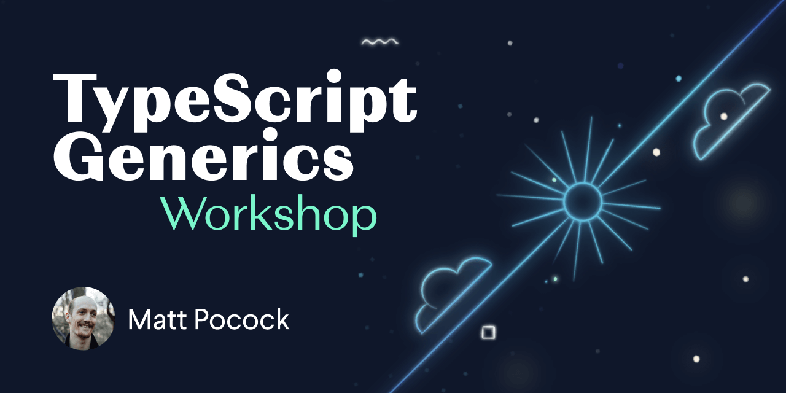

<a href="https://totaltypescript.com"></a>

## Quickstart

Clone this repo or [open in Gitpod](https://gitpod.io/#https://github.com/total-typescript/typescript-generics-tutorial).

```sh
# Installs all dependencies
npm install

# Asks you which exercise you'd like to run, and runs it
npm run exercise
```

## How to take the course

You'll notice that the course is split into exercises. Each exercise is split into a `*.problem` and a `*.solution`.

To take an exercise:

1. Run `npm run exercise`
2. Choose which exercise you'd like to run.

This course encourages **active, exploratory learning**. In the video, I'll explain a problem, and **you'll be asked to try to find a solution**. To attempt a solution, you'll need to:

1. Check out [TypeScript's docs](https://www.typescriptlang.org/docs/handbook/intro.html).
1. Try to find something that looks relevant.
1. Give it a go to see if it solves the problem.

You'll know if you've succeeded because the tests will pass.

**If you succeed**, or **if you get stuck**, unpause the video and check out the `*.solution`. You can see if your solution is better or worse than mine!

## Acknowledgements

Say thanks to Matt on [Twitter](https://twitter.com/mattpocockuk) or by joining his [Discord](https://discord.gg/8S5ujhfTB3). Consider signing up to his [Total TypeScript course](https://totaltypescript.com).

## Reference

### `npm run exercise`

Alias: `npm run e`

Open a prompt for choosing which exercise you'd like to run.
